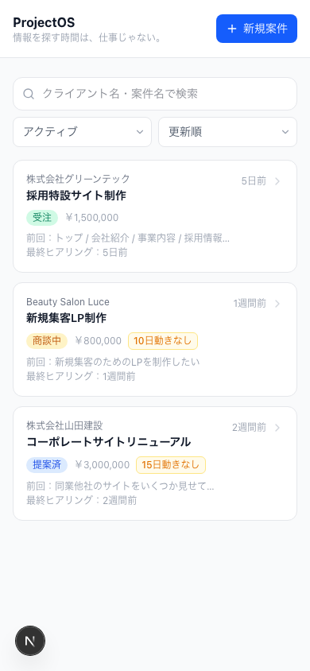
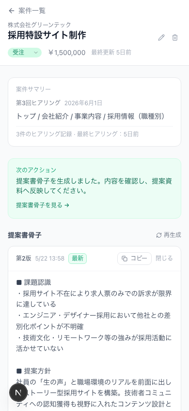
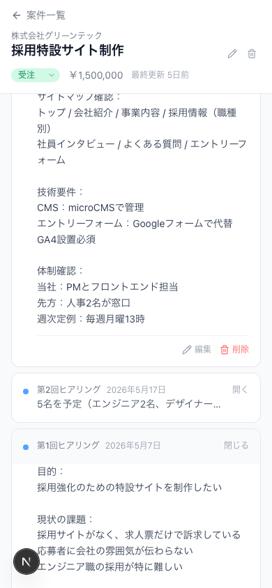
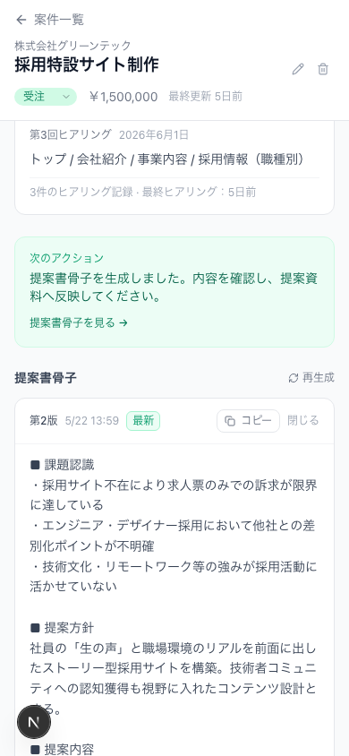
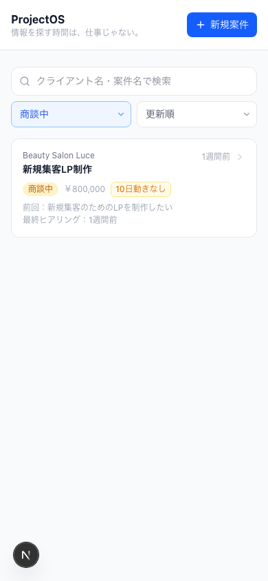

# ProjectOS

> **情報を探す時間は、仕事じゃない。**

ProjectOS は、1〜5人規模のWeb制作会社向けに設計された案件管理SaaSです。ヒアリング記録の蓄積から、AIによる提案書骨子の自動生成まで、案件の文脈を一箇所に集約します。

---

## スクリーンショット

| 案件一覧 | 案件詳細 |
|----------|----------|
|  |  |

| ヒアリング記録 | 提案書骨子 |
|----------------|-----------|
|  |  |

| 検索・フィルター・並び替え |
|--------------------------|
|  |

---

## コンセプト

「あのお客さんの要件、どこに書いたっけ？」「前回のヒアリング内容は何だった？」

Web制作の現場では、情報が散在していることが日常の非効率を生んでいます。ProjectOS は案件ごとにヒアリングを積み重ね、そのまま提案書の骨子をAIで生成することで、**情報を探す時間をゼロにする**ことを目指しています。

---

## ターゲット

- 1〜5人規模のWeb制作会社
- フリーランスWebディレクター
- 案件管理ツールに複雑さを求めていない人

---

## 主な機能

| 機能 | 説明 |
|------|------|
| **案件管理** | クライアント名・案件名・予算・ステータスを一元管理 |
| **ヒアリング記録** | 時系列でヒアリング内容を蓄積・編集・削除 |
| **提案書骨子生成** | ヒアリング記録をもとにGPT-4oが提案書の骨子を自動生成 |
| **スマートフィルター** | アクティブ案件・ステータス別・放置日数順での絞り込み |
| **放置アラート** | 商談中・提案済の案件で7日以上動きがない場合にアラート表示 |
| **骨子履歴管理** | 提案書骨子の世代管理（バージョン管理）と一括コピー |

---

## 使用技術

| カテゴリ | 技術 |
|----------|------|
| Framework | Next.js 16 (App Router) |
| Language | TypeScript |
| UI | React 19, Tailwind CSS v4 |
| AI | OpenAI GPT-4o |
| Storage | localStorage（ブラウザローカル保存） |
| Icons | lucide-react |

---

## セットアップ

### 1. リポジトリをクローン

```bash
git clone <repository-url>
cd ProjectOS
npm install
```

### 2. 環境変数を設定

```bash
cp .env.local.example .env.local
```

`.env.local` を開いて、OpenAI API キーを設定してください：

```
OPENAI_API_KEY=sk-...
```

OpenAI API キーは [platform.openai.com/api-keys](https://platform.openai.com/api-keys) で取得できます。

### 3. 開発サーバーを起動

```bash
npm run dev
```

[http://localhost:3000](http://localhost:3000) をブラウザで開いてください。

---

## デモデータの読み込み

セットアップ後、以下のURLにアクセスするとデモ用のサンプル案件3件が自動で挿入されます。

```
http://localhost:3000/seed
```

**含まれるサンプル案件：**
- 株式会社山田建設 — コーポレートサイトリニューアル（提案済・放置アラートあり）
- Beauty Salon Luce — 新規集客LP制作（商談中・放置アラートあり）
- 株式会社グリーンテック — 採用特設サイト制作（受注・ヒアリング3件・骨子2件）

> ⚠️ 既存データは上書きされます。

---

## スクリーンショット撮影ポイント

### 1. 案件一覧（`/projects`）
- **見せ場**: 放置アラートバッジ（商談中・提案済の案件）、ステータスバッジのカラー差分
- **フィルター切り替え**: アクティブ → 完了 → すべて の変化
- **並び替え**: 放置日数が長い順に切り替えた状態

### 2. 案件詳細 — グリーンテック（`/projects/{id}`）
- **見せ場**: ヒアリング3件の折りたたみUI、提案書骨子2件のバージョン管理
- **次のアクション**: 提案書骨子生成済みのエメラルドカード
- **ドキュメント棚**: 提案書骨子「生成済み」状態

### 3. ヒアリング記録（`/projects/{id}/hearings/new`）
- **見せ場**: シンプルな日付＋メモ入力フォーム

### 4. 提案書骨子履歴（案件詳細内）
- **見せ場**: 第1版・第2版のアコーディオン、最新バッジ、コピーボタン

### 5. 検索・フィルター・並び替え
- **見せ場**: 3つの操作（検索ボックス＋2つのselect）が同一画面に収まっているコンパクトさ

---

## 今後の改善予定（v2候補）

### 優先度：高

| 機能 | 理由 |
|------|------|
| **クラウド同期** | 現在localStorage限定のため、デバイス間共有・チーム利用が不可。Supabase等での実装が最優先 |
| **見積書生成** | ヒアリング記録と予算からAIが見積もりを生成。UIプレースホルダーは実装済み |
| **放置リマインダー** | 商談中・提案済の案件で一定日数後にメール通知 |

### 優先度：中

| 機能 | 理由 |
|------|------|
| **チームシェア** | 複数人での案件閲覧・コメント機能 |
| **ヒアリングテンプレート** | 業種別（EC・LP・採用サイト等）の入力テンプレート |
| **Notionエクスポート** | 提案書骨子をNotionページとして書き出し |

### 優先度：低

| 機能 | 理由 |
|------|------|
| **PWA対応** | スマートフォンからのヒアリング入力をより快適に |
| **CSV出力** | 案件一覧・ヒアリング記録の外部エクスポート |

---

## ライセンス

Private — All rights reserved.
